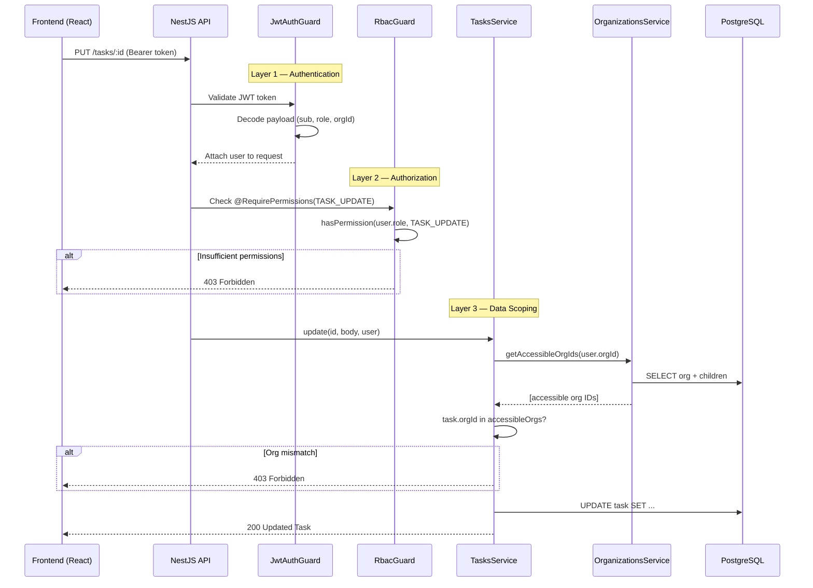

# Secure Task Management System

A full-stack task management application with **role-based access control (RBAC)**, built as a modular **NX monorepo** with a **NestJS** backend and **React** frontend.

---

## Table of Contents

- [Setup Instructions](#setup-instructions)
- [Architecture Overview](#architecture-overview)
- [Data Model Explanation](#data-model-explanation)
- [Access Control Implementation](#access-control-implementation)
- [API Documentation](#api-documentation)
- [Testing](#testing)
- [Bonus Features](#bonus-features)
- [Future Considerations](#future-considerations)
- [Tradeoffs & Unfinished Areas](#tradeoffs--unfinished-areas)

---

## Setup Instructions

### Prerequisites

- **Node.js** >= 18.x
- **PostgreSQL** >= 14.x
- **npm** >= 9.x

### 1. Clone and Install

```bash
git clone <repository-url>
cd task-app-turbovets
npm install
```

### 2. Environment Configuration

Copy `.env.example` to `.env` and configure:

```bash
cp .env.example .env
```

**Required `.env` values:**

```env
# Database
DB_HOST=localhost
DB_PORT=5432
DB_USERNAME=postgres
DB_PASSWORD=postgres
DB_DATABASE=task_management
DB_SYNC=true

# JWT
JWT_SECRET=your-super-secret-jwt-key-change-this-in-production
JWT_EXPIRATION=24h

# API
PORT=3000
CORS_ORIGIN=http://localhost:5173

# Frontend
VITE_API_URL=http://localhost:3000/api
```

### 3. Create PostgreSQL Database

```bash
psql -U postgres -c "CREATE DATABASE task_management;"
```

### 4. Seed the Database

```bash
cd apps/api
npx ts-node -r tsconfig-paths/register src/seed/seed.ts
```

This creates:

- **3 Organizations**: TurboVets Corp (parent), Engineering Dept (child), Marketing Dept (child)
- **4 Users** (all with password: `password123`):
  - `owner@turbovets.com` — Owner role (TurboVets Corp)
  - `admin@turbovets.com` — Admin role (Engineering Dept)
  - `viewer@turbovets.com` — Viewer role (Engineering Dept)
  - `admin2@turbovets.com` — Admin role (Marketing Dept)
- **8 Sample Tasks** across different statuses and categories

### 5. Run the Applications

**Backend API** (runs on http://localhost:3000):

```bash
cd apps/api
npx nest start --watch
```

**Frontend Dashboard** (runs on http://localhost:5173):

```bash
cd apps/dashboard
npx vite
```

---

## Architecture Overview

### The 3-layer security



The three layer of security are

1. Authentication (JWT auth).
2. Authorization (Roles and Permissions).
3. Data scoping (`accessibleOrgIds()`).

### NX Monorepo Layout

```
├── apps/
│   ├── api/                  → NestJS backend (REST API)
│   │   ├── src/
│   │   │   ├── auth/         → JWT authentication (guards, strategy, controller)
│   │   │   ├── users/        → User entity and service
│   │   │   ├── organizations/→ Organization entity and hierarchy logic
│   │   │   ├── tasks/        → Task CRUD with permission checks
│   │   │   ├── audit/        → Audit logging (DB + console) with org/role scoping
│   │   │   ├── rbac/         → Guards and decorators for access control
│   │   │   └── seed/         → Database seeding script
│   │   └── test/             → Jest unit tests
│   │
│   └── dashboard/            → React + TailwindCSS frontend
│       └── src/
│           ├── api/          → Axios client with JWT interceptor
│           ├── store/        → Zustand state management
│           ├── components/   → Reusable UI components (TaskCard, TaskBoard, TaskForm, Header)
│           ├── pages/        → Route pages (Login, Dashboard, Analytics, AuditLog)
│           └── __tests__/    → Jest unit tests for Zustand stores
│
├── libs/
│   ├── data/                 → Shared TypeScript interfaces and DTOs
│   │   └── src/
│   │       ├── interfaces/   → IUser, ITask, IOrganization, IAuditLog, IPermission
│   │       └── dto/          → CreateTaskDto, UpdateTaskDto, LoginDto
│   │
│   └── auth/                 → Reusable RBAC logic
│       └── src/
│           └── rbac/         → Role-permission mappings, hierarchy, utilities
│
├── .env                      → Environment configuration
├── nx.json                   → NX workspace configuration
├── tsconfig.base.json        → Shared TypeScript configuration
└── package.json              → Root workspace dependencies
```

### Rationale

- **Shared `libs/data`**: All TypeScript interfaces, enums, and DTOs are shared between frontend and backend, ensuring type safety and consistency across the full stack.
- **Shared `libs/auth`**: RBAC logic (role-permission mappings, hierarchy checks) is decoupled from NestJS, making it reusable and independently testable.
- **Modular NestJS Backend**: Each domain (auth, users, tasks, organizations, audit) is a separate module following NestJS best practices.
- **Zustand for State Management**: Lightweight, minimal boilerplate, and excellent TypeScript support.
- **Webpack Bundling**: Custom webpack config resolves monorepo path aliases (`@task-management/data`, `@task-management/auth`) for the NestJS build, while correctly externalizing native modules like `bcrypt`.

---

## Data Model Explanation

### Entity Relationship Diagram (ERD)

```
┌─────────────────┐       ┌─────────────────────┐
│  organizations   │       │       users          │
├─────────────────┤       ├─────────────────────┤
│ id          UUID │◄──┐  │ id             UUID  │
│ name     VARCHAR │   │  │ email       VARCHAR  │
│ parent_id   UUID │───┘  │ password    VARCHAR  │
│ created_at  DATE │      │ first_name  VARCHAR  │
│ updated_at  DATE │      │ last_name   VARCHAR  │
└────────┬────────┘      │ role          ENUM   │
         │               │ organization_id UUID │──┐
         │               │ created_at      DATE │  │
         │               │ updated_at      DATE │  │
         │               └──────────┬──────────┘  │
         │                          │              │
         ▼                          ▼              ▼
┌─────────────────────────────────────────────────────┐
│                       tasks                          │
├─────────────────────────────────────────────────────┤
│ id               UUID                                │
│ title            VARCHAR(500)                        │
│ description      TEXT                                │
│ status           ENUM (todo, in_progress, done)      │
│ category         ENUM (work, personal, urgent, other)│
│ position         INT                                 │
│ start_date       DATE (nullable)                     │
│ due_date         DATE (nullable)                     │
│ assignee_id      UUID  ──► users.id                  │
│ organization_id  UUID  ──► organizations.id          │
│ created_by_id    UUID  ──► users.id                  │
│ created_at       DATE                                │
│ updated_at       DATE                                │
└─────────────────────────────────────────────────────┘

┌─────────────────────────────────────────────────────┐
│                    audit_logs                         │
├─────────────────────────────────────────────────────┤
│ id               UUID                                │
│ user_id          UUID  ──► users.id                  │
│ action           ENUM (CREATE, READ, UPDATE, DELETE, │
│                        LOGIN, LOGIN_FAILED)          │
│ resource         VARCHAR(100)                        │
│ resource_id      UUID (nullable)                     │
│ details          TEXT (nullable)                      │
│ ip_address       VARCHAR(45) (nullable)              │
│ created_at       DATE                                │
└─────────────────────────────────────────────────────┘
```

### Organization Hierarchy (2-Level, Top-Down Visibility)

```
TurboVets Corp (Parent)
├── Engineering Dept (Child)
└── Marketing Dept (Child)
```

Follows the **standard hierarchical model** based on the Principle of Least Privilege:

- **Parent organizations** can see all tasks across their child organizations (top-down visibility).
- **Child organizations** can see **only their own data** — they cannot see parent or sibling org data.
- This enforces proper **tenant isolation**: child orgs are sandboxed, only the parent has downward visibility.
- Implemented via a self-referencing `parent_id` foreign key and `getAccessibleOrgIds()` in `OrganizationsService`.

---

## Access Control Implementation

### Three-Layer Security Model

Every API request passes through three layers of access control:

1. **Authentication (`JwtAuthGuard`)** — Validates the JWT token. Applied globally; only `@Public()` routes are exempt.
2. **Authorization (`RbacGuard`)** — Checks `@Roles()` and `@RequirePermissions()` decorators against the user's role.
3. **Data Scoping (Service Layer)** — Filters queries by organization hierarchy and ownership.

### Roles

| Role   | Hierarchy Level | Description                        |
| ------ | --------------- | ---------------------------------- |
| Owner  | 3 (highest)     | Full access, manages users and org |
| Admin  | 2               | CRUD on tasks, view audit logs     |
| Viewer | 1 (lowest)      | Read-only access to own tasks      |

### Permission Matrix

| Permission  | Viewer | Admin | Owner |
| ----------- | ------ | ----- | ----- |
| task:read   | ✅     | ✅    | ✅    |
| task:create | ❌     | ✅    | ✅    |
| task:update | ❌     | ✅    | ✅    |
| task:delete | ❌     | ✅    | ✅    |
| audit:read  | ❌     | ✅    | ✅    |
| user:manage | ❌     | ❌    | ✅    |
| org:manage  | ❌     | ❌    | ✅    |

### Role Inheritance

Permissions cascade upward: **Owner** inherits all **Admin** permissions, and **Admin** inherits all **Viewer** permissions. Implemented in `libs/auth/src/rbac/roles.ts` using array spreading.

### JWT Integration

1. **Login** → `POST /api/auth/login` validates credentials via bcrypt, returns a signed JWT containing `{ sub, email, role, organizationId }`.
2. **Global Guard** → `JwtAuthGuard` is applied globally via `APP_GUARD`. All endpoints require a valid JWT except those decorated with `@Public()`.
3. **RBAC Guard** → `RbacGuard` is applied per-controller. It reads decorator metadata and checks the user's role/permissions from the JWT payload.
4. **Organization Scoping** → Task and audit queries are scoped to the user's accessible organization IDs based on the hierarchy.

### Task Visibility Rules

| Role   | Can See                                                       |
| ------ | ------------------------------------------------------------- |
| Owner  | All tasks across own org + all child orgs                     |
| Admin  | All tasks within own org only (isolated from parent/siblings) |
| Viewer | Only tasks assigned to them within own org                    |

### Audit Log Visibility Rules

| Role   | Can See                                                                      |
| ------ | ---------------------------------------------------------------------------- |
| Owner  | All audit logs from own org + child orgs (all role levels)                   |
| Admin  | Logs within own org only, from users at or below Admin level (no Owner logs) |
| Viewer | No access (blocked by RBAC guard)                                            |

---

## API Documentation

### Authentication

#### `POST /api/auth/login`

Authenticates a user and returns a JWT.

**Request:**

```json
{
  "email": "admin@turbovets.com",
  "password": "password123"
}
```

**Response (200):**

```json
{
  "accessToken": "eyJhbGciOiJIUzI1NiIsInR5cCI6IkpXVCJ9...",
  "user": {
    "id": "uuid",
    "email": "admin@turbovets.com",
    "firstName": "Bob",
    "lastName": "Admin",
    "role": "admin",
    "organizationId": "uuid"
  }
}
```

### Tasks

All task endpoints require `Authorization: Bearer <token>` header.

#### `POST /api/tasks`

Creates a new task. **Requires**: `task:create` permission (Admin, Owner).

**Request:**

```json
{
  "title": "Implement feature X",
  "description": "Build the new dashboard widget",
  "status": "todo",
  "category": "work",
  "startDate": "2026-02-15",
  "dueDate": "2026-02-28"
}
```

**Response (201):**

```json
{
  "id": "uuid",
  "title": "Implement feature X",
  "description": "Build the new dashboard widget",
  "status": "todo",
  "category": "work",
  "position": 5,
  "startDate": "2026-02-15",
  "dueDate": "2026-02-28",
  "assigneeId": "uuid",
  "organizationId": "uuid",
  "createdById": "uuid",
  "createdAt": "2026-02-14T...",
  "updatedAt": "2026-02-14T..."
}
```

#### `GET /api/tasks`

Lists accessible tasks, scoped by role and organization. **Requires**: `task:read` permission.

**Query Parameters:**

- `status` — Filter by status (`todo`, `in_progress`, `done`)
- `category` — Filter by category (`work`, `personal`, `urgent`, `other`)
- `search` — Search by title or description (case-insensitive)

#### `PUT /api/tasks/:id`

Updates a task. **Requires**: `task:update` permission (Admin, Owner). Organization access is verified in the service layer.

**Request:**

```json
{
  "title": "Updated title",
  "status": "in_progress",
  "dueDate": "2026-03-15"
}
```

#### `DELETE /api/tasks/:id`

Deletes a task. **Requires**: `task:delete` permission (Admin, Owner). Verifies org access + role level (`isRoleAtLeast(Admin)`).

### Audit Log

#### `GET /api/audit-log`

Returns access and activity logs, scoped to the requesting user's organization and role level.

**Requires**: Admin or Owner role + `audit:read` permission.

**Query Parameters:**

- `page` — Page number (default: 1)
- `limit` — Items per page (default: 20, max: 100)

**Response (200):**

```json
{
  "data": [
    {
      "id": "uuid",
      "userId": "uuid",
      "action": "CREATE",
      "resource": "task",
      "resourceId": "uuid",
      "details": "Created task: Implement feature X",
      "ipAddress": "::1",
      "createdAt": "2026-02-14T...",
      "user": {
        "firstName": "Bob",
        "lastName": "Admin",
        "email": "admin@turbovets.com",
        "role": "admin"
      }
    }
  ],
  "total": 42,
  "page": 1,
  "limit": 20,
  "totalPages": 3
}
```

---

## Testing

### Running Tests

```bash
# Backend tests
cd apps/api
npx jest --config jest.config.ts

# Frontend tests
cd apps/dashboard
npx jest --config jest.config.ts
```

### Test Coverage

#### Backend (57 tests)

| Test Suite              | Tests | Description                                    |
| ----------------------- | ----- | ---------------------------------------------- |
| `rbac.spec.ts`          | 22    | Role hierarchy, permission checks, inheritance |
| `rbac.guard.spec.ts`    | 8     | NestJS RBAC guard behavior for all role combos |
| `auth.service.spec.ts`  | 6     | Login, token validation, audit logging         |
| `tasks.service.spec.ts` | 11    | CRUD operations, org scoping, role enforcement |

#### Frontend (29 tests)

| Test Suite           | Tests | Description                                            |
| -------------------- | ----- | ------------------------------------------------------ |
| `authStore.spec.ts`  | 8     | Login/logout, localStorage persistence, error handling |
| `taskStore.spec.ts`  | 14    | CRUD operations, filtering, drag-and-drop reordering   |
| `themeStore.spec.ts` | 7     | Dark/light mode toggle, system preference fallback     |

**Total: 86 tests across backend and frontend.**

### What's Tested

- **RBAC Logic**: Role hierarchy, permission inheritance, role-at-least comparisons
- **RBAC Guard**: Access control for all role combinations, decorator metadata resolution, missing user handling
- **Authentication**: Login success/failure, JWT signing, token validation, audit logging of login events
- **Task Service**: Create/update/delete with permission checks, organization scoping, Viewer restrictions
- **Frontend Stores**: Auth flow (login, logout, localStorage restore), task CRUD and reorder operations, theme toggling and persistence

---

## Bonus Features

### Task Completion Visualization

- Dedicated **Analytics page** with KPI cards, progress rings, bar charts, and pie charts
- Overdue task tracking with a dedicated table showing days overdue per task
- Assignee workload breakdown with completion rates and overdue counts per user

### Dark/Light Mode Toggle

- System preference detection on first visit
- Toggle via header button or keyboard shortcut (`Ctrl+D`)
- Persisted in localStorage

### Keyboard Shortcuts

- `N` — Create new task (when not focused on an input)
- `Ctrl+D` — Toggle dark/light mode
- `Escape` — Close modal

### Drag-and-Drop

- **Cross-column drag**: Drag a task card from one status column to another to change its status (e.g., To Do → In Progress → Done)
- **Within-column reorder**: Drag to reorder tasks within the same column
- Visual feedback: column highlight on hover, ghost card overlay while dragging

### Task Scheduling

- Start date and due date on all tasks
- **Overdue indicators** on task cards: red accent bar, red border, and days-overdue badge
- **Due soon** warnings (within 2 days): amber badge
- Overdue analytics with per-assignee breakdown

---

## Future Considerations

### Advanced Role Delegation

- Allow Owners to create custom roles with fine-grained permission sets
- Support role delegation where Admins can assign roles within their scope

### Production-Ready Security

- **JWT Refresh Tokens**: Implement short-lived access tokens (15min) with long-lived refresh tokens to reduce token exposure risk
- **CSRF Protection**: Add CSRF tokens for cookie-based authentication if migrating from header-based JWT
- **RBAC Caching**: Cache role-permission lookups in Redis to avoid repeated DB queries on every request
- **Rate Limiting**: Add rate limiting on login endpoint to prevent brute-force attacks
- **Password Policy**: Enforce minimum complexity, expiry, and breach detection

### Scaling Permission Checks

- Implement permission caching layer (Redis/in-memory)
- Use database views or materialized views for complex org hierarchy queries
- Consider moving to a dedicated authorization service (e.g., Open Policy Agent)

### Additional Features

- WebSocket-based real-time task updates
- File attachments on tasks
- Task comments and activity feed
- Email notifications for task assignments
- Multi-tenant isolation at the database level

---

## Tradeoffs & Unfinished Areas

1. **Database Synchronize Mode**: `DB_SYNC=true` is used for development convenience. In production, proper migrations via TypeORM's migration system should be used.

2. **Refresh Tokens**: Only access tokens are implemented. A production system should include refresh token rotation for better security.

3. **Task Pagination**: Task listing returns all accessible tasks without pagination. For large datasets, cursor-based pagination would be recommended. (Audit logs do use server-side pagination.)

4. **API Documentation**: Swagger/OpenAPI documentation is not auto-generated. A production system should use `@nestjs/swagger` for auto-generated interactive API docs.

5. **Error Handling**: While validation and auth errors are handled, a more comprehensive global error handling strategy with custom exception filters would improve the API's robustness.

6. **E2E Tests**: Unit tests cover RBAC logic, services, guards, and frontend stores (86 tests total). End-to-end integration tests (e.g., with Supertest) and frontend component tests (e.g., React Testing Library) would further strengthen confidence.
